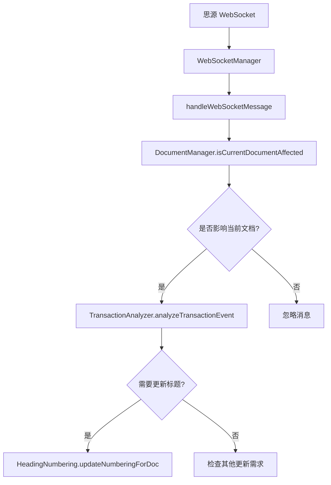

# DocumentStyler 插件架构说明

## 概述

DocumentStyler 插件采用模块化架构设计，遵循单一职责原则，将不同的功能分离到专门的管理器中。

## 核心模块

### 1. WebSocketManager
**职责**：WebSocket 连接和消息处理
- 管理与思源 WebSocket 的连接
- 处理 WebSocket 消息的接收和分发
- 提供事件监听和过滤功能
- 维护监听器的生命周期

**不负责**：
- ❌ 文档相关的业务逻辑判断
- ❌ 具体的文档变更分析
- ❌ 文档状态管理

```typescript
// WebSocketManager 的核心职责
class WebSocketManager {
    // ✅ WebSocket 连接管理
    private connectToWebSocket(): void
    private handleWebSocketMessage(msg: any): void
    
    // ✅ 事件监听
    public whenBlockSaved(filter?: IWebSocketFilter): Promise<any>
    public listen(options: IWebSocketListenerOptions): Promise<any>
    
    // ✅ 生命周期管理
    public init(): Promise<void>
    public destroy(): void
}
```

### 2. DocumentManager
**职责**：文档状态管理和文档相关的业务逻辑
- 管理当前聚焦的文档状态
- 提供文档相关的判断方法
- 处理文档切换和加载事件
- 缓存文档信息

**新增方法**：
```typescript
class DocumentManager {
    // ✅ 文档变更检测
    isCurrentDocumentAffected(msg: any): boolean
    isDocumentAffected(msg: any, docId: string): boolean
    getAffectedDocumentIds(msg: any): string[]
    
    // ✅ 文档状态管理
    getCurrentDocId(): string | null
    getCurrentProtyle(): any
    updateCurrentDocument(protyle?: any): void
}
```

### 3. 其他核心模块

#### SettingsManager
- 管理插件设置和配置
- 处理文档级别的启用/禁用状态

#### HeadingNumbering
- 处理标题编号的生成和应用
- 管理编号格式和样式

#### OutlineManager
- 管理文档大纲数据的获取和缓存
- 解析大纲结构

#### TransactionAnalyzer
- 分析 WebSocket transaction 事件
- 识别需要更新的内容类型

## 架构优势

### 1. 单一职责原则
每个模块都有明确的职责边界：
- WebSocketManager 专注于 WebSocket 通信
- DocumentManager 专注于文档状态管理
- 避免了职责混乱和代码耦合

### 2. 可测试性
模块化设计使得每个组件都可以独立测试：
```typescript
// 可以独立测试 DocumentManager 的文档检测逻辑
test('DocumentManager.isCurrentDocumentAffected', () => {
    const documentManager = new DocumentManager(mockApp);
    expect(documentManager.isCurrentDocumentAffected(mockMessage)).toBe(true);
});

// 可以独立测试 WebSocketManager 的连接逻辑
test('WebSocketManager connection', () => {
    const wsManager = new WebSocketManager(mockDeps);
    expect(wsManager.isWebSocketConnected()).toBe(true);
});
```

### 3. 可维护性
- 文档相关的逻辑集中在 DocumentManager 中
- WebSocket 相关的逻辑集中在 WebSocketManager 中
- 修改一个模块不会影响其他模块

### 4. 可扩展性
- 可以轻松添加新的文档检测方法到 DocumentManager
- 可以扩展 WebSocketManager 支持更多类型的事件监听
- 模块间通过接口通信，便于替换实现

## 数据流



## 重构前后对比

### 重构前
```typescript
// ❌ WebSocketManager 包含文档业务逻辑
class WebSocketManager {
    private isCurrentDocumentAffected(msg: any, currentDocId: string): boolean {
        // 文档检测逻辑混在 WebSocket 管理器中
    }
    
    private getCurrentDocId(): string | null {
        // 文档状态获取混在 WebSocket 管理器中
    }
}
```

### 重构后
```typescript
// ✅ 职责分离，各司其职
class WebSocketManager {
    private handleTransactionMessage(msg: any): Promise<void> {
        // 只负责 WebSocket 消息处理
        const isAffected = this.documentManager.isCurrentDocumentAffected(msg);
        if (isAffected) {
            // 触发相应的更新逻辑
        }
    }
}

class DocumentManager {
    public isCurrentDocumentAffected(msg: any): boolean {
        // 专门处理文档相关的业务逻辑
    }
}
```

## 最佳实践

### 1. 模块职责边界
- 每个模块只处理自己领域内的逻辑
- 避免跨领域的方法调用
- 通过依赖注入实现模块间通信

### 2. 接口设计
- 提供清晰的公共接口
- 隐藏内部实现细节
- 保持接口的稳定性

### 3. 错误处理
- 每个模块负责自己的错误处理
- 提供有意义的错误信息
- 避免错误在模块间传播

### 4. 测试策略
- 单元测试：测试每个模块的独立功能
- 集成测试：测试模块间的协作
- 端到端测试：测试完整的用户场景

## 未来扩展

### 1. 支持更多文档类型
可以在 DocumentManager 中添加更多的文档检测方法：
```typescript
class DocumentManager {
    isImageDocumentAffected(msg: any): boolean
    isTableDocumentAffected(msg: any): boolean
    isCodeBlockDocumentAffected(msg: any): boolean
}
```

### 2. 支持批量文档处理
可以扩展支持同时处理多个文档的变更：
```typescript
class DocumentManager {
    getAffectedDocuments(msg: any): DocumentInfo[]
    processBatchDocumentChanges(changes: DocumentChange[]): void
}
```

### 3. 支持更复杂的事件过滤
可以在 WebSocketManager 中添加更高级的过滤器：
```typescript
interface IAdvancedFilter {
    documentTypes?: string[];
    operationTypes?: string[];
    timeRange?: { start: Date; end: Date };
}
```

这种模块化架构为插件的长期维护和功能扩展提供了坚实的基础。
